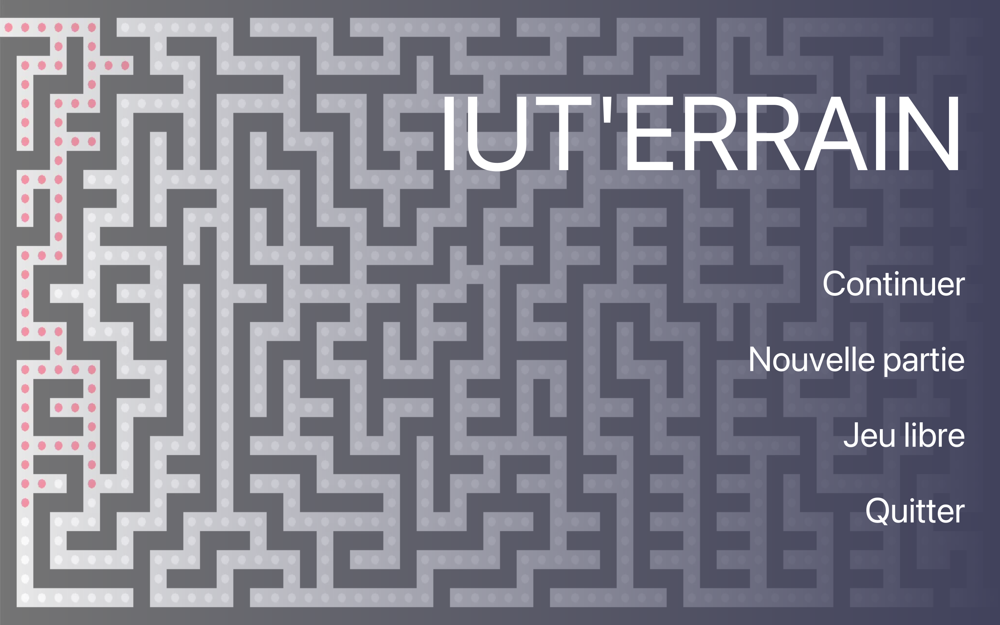

# 🎮 IUT'ERRAIN

Un jeu de labyrinthe riche en fonctionnalités, développé en Java avec JavaFX, basé sur le pattern MVC.



## 📖 Description

IUT'ERRAIN est un jeu de labyrinthe où le joueur doit trouver son chemin de l'entrée jusqu'à la sortie. Le jeu propose deux modes :
* **Mode Libre :** Générez des labyrinthes personnalisés avec les paramètres de votre choix.
* **Mode Progression :** Suivez une série de niveaux avec une difficulté croissante.

## ⚙️ Analyse Technique & Architecture

Ce projet a été conçu avec une volonté forte de respecter les bonnes pratiques de l'ingénierie logicielle.

* **Architecture MVC (Modèle-Vue-Contrôleur) :** Séparation stricte entre les données (génération du labyrinthe, calcul des positions), l'interface (fichiers FXML) et la logique d'interaction.
* **Génération Procédurale :** Implémentation d'algorithmes de génération de labyrinthes capables de s'adapter à la taille et à la densité de murs demandées par le joueur.
* **Mécanique de Vue Restreinte :** Gestion dynamique du rendu visuel sur JavaFX pour simuler un "brouillard de guerre" autour du joueur, mis à jour à chaque déplacement.
* **Persistance des données :** Mise en place d'un système de sauvegarde de la progression et de gestion des scores.
* **Assurance Qualité :** Intégration de tests unitaires avec **JUnit 5** pour valider la logique de déplacement et de génération, garantissant un code robuste.

## ✨ Fonctionnalités

* 🎯 Plusieurs modes de jeu (Libre et Progression).
* 🎮 Contrôles intuitifs (ZQSD/WASD ou flèches directionnelles).
* 🌫️ Option de vue restreinte pour plus de défi.
* 🎵 Effets sonores intégrés.
* 💾 Sauvegarde de la progression et système de score.

## 🛠️ Technologies utilisées

* **Langage :** Java 17
* **Interface Graphique :** JavaFX & FXML
* **Tests Unitaires :** JUnit 5
* **Build & Dépendances :** Maven

## 🚀 Installation et Exécution

**Environnement requis :** Java 17 (ou supérieur) et Maven 3.6 (ou supérieur).

**1. Clonez le dépôt :**
```bash
git clone [https://github.com/ylannwattrelos/IUTerrain.git](https://github.com/ylannwattrelos/IUTerrain.git)
```

**2. Installez les dépendances avec Maven :**
```bash
mvn install
```

**3. Lancez l'application :**
```bash
mvn javafx:run
```

## 🧪 Tests
Le projet inclut une suite de tests unitaires couvrant la logique métier. Pour les exécuter :
```bash
mvn test
```

## 📂 Structure du projet

```
src/
├── main/
│   ├── java/          # Code source
│   └── resources/     # Ressources (images, sons, etc.)
└── test/
    └── java/          # Tests unitaires
```

## 👥 Auteurs

- Gaël Dierynck
- Dawid Banas
- Ylann Wattrelos
- Mark Zavadskyi

## 📄 Licence et Documentation additionnelle

Ce projet est sous licence MIT.

[suivi.md](./Rapports-src/suivi.md)  
[rapport dev efficace](./Rapports-src/Rapport_Dev-Efficace.md)  
[rappord qualité de dév](./Rapports-src/Rapport_Dev-Qualité.md)